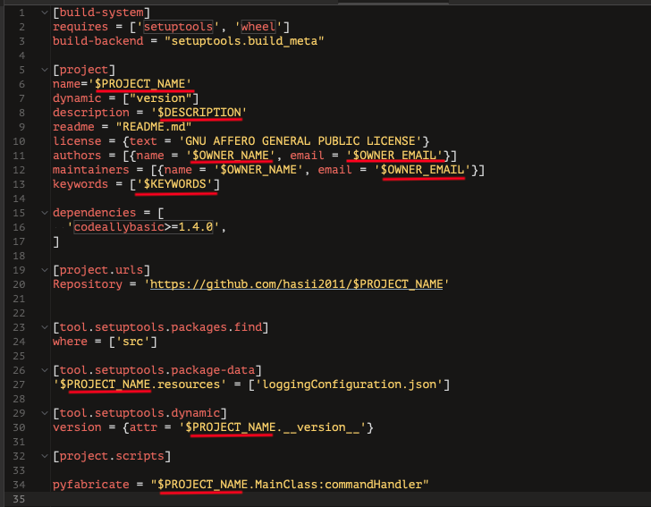

# Introduction

PyFabricate is a Mac OS X application that simplifies the creation of Python projects.  Since I authored it, obviously it is an opinionated 
version of what I think a Python project should look like.  Additionally, I have a certain toolset that I use to enable me to write Python 
Mac OS X applications.  However, I tried to create a bit of customization by exposing the templates from which I create project files.  More on this later.

# Overview

PyFabricate uses a wizard-like interface to query for the project details.

## Opinionated Assumptions

- The developer uses [HomeBrew](https://brew.sh) to install the opinionated dependencies.
    - Python is managed via [pyenv](https://github.com/pyenv/pyenv) (For use in the created virtual environments)
    - [direnv](https://github.com/direnv/direnv) is installed (optional)
- The project name is the same as the module package name

# Installation

Get the current release from [here](https://github.com/hasii2011/pyfabricate/releases).

Copy this file to your Mac OS applications folder.  The application is Apple code signed so you will get a simple message you have to  acknowledge the first time you execute it.

# Project Skeleton Details

The following is a sample of the initial skeleton that PyFabricate creates.  It does now show the virtual environment that it 
creates.  More on this later.

Essentially, PyFabricate creates  the `src` and `tests` directories.   In the project root directory it creates the following files:

* .envrc
* .gitignore
* .mypi.ini
* .python_version
* .LICENSE
* README.md
* pyproject.toml
* requirements.txt

Additionally, PyFabricate creates all the python package files (\_\_init\__.py) in all the appropriate places.  And finally, it places two sets of logging configurations files, one for your application and one for your unit tests. 

At the end of the fabrication, PyFabricate creates a Python virtual environment. Because of technical limitations PyFabricate cannot use a [pyenv](https://github.com/pyenv/pyenv) version of Python to create the virtual environment.  Thus, it depends on a [homebrew](https://brew.sh) installed version.

# Wizard UI

The wizard UI is a 4 step process where PyFabricate gathers sufficient project details that it uses to populate the skeleton templates.  The templates use the following self-explanatory substitution tokens.

| Token Name     | Description                                                  |
| ------------- | ----------------------------------------------------------- |
| PROJECT_NAME   | Used to construct the base project directory and is the Python module name |
| DESCRIPTION    | Placed as the description in the generated `pyproject.toml`  |
| OWNER_NAME     | Placed as the author name and maintainer name in the generated `pyproject.toml` |
| OWNER_EMAIL    | Placed as the email address for both the author and the maintainer in the generated `pyproject.toml` |
| KEYWORDS       | Used as the project keywords in the generated `pyproject.toml` |
| PYTHON_VERSION | Used in the generated .gitignore file to exclude the directory that contains the virtual environment.  Additionally appended as the directory name for the generated virtual environment.  For example, '`pyenv-3.12.0`' |

The following is an annotated graphic of the `pyroject.toml` template.

## Wizard UI Step 1 - Introduction

This step is an introduction to PyFabricate.  After this step, PyFabricate does a best effort to ensure that its execution dependencies are met.  If not, the developer cannot proceed past this step.

## Wizard UI Step 2 - Project Details

At this step PyFabricate collects project specific information.   Most of this serves to populate the `pyproject.toml` template.

## Wizard UI Step 3  - Base Directory

PyFabricate assumes that the developer keeps all of his Python projects in a single subdirectory.   This is an opinionated view and is simply an organizational preference.

## Wizard UI Step 4 - Python Version

PyFabricate queries [pyenv](https://github.com/pyenv/pyenv) for the developer installed Python versions.  These are the only ones from which PyFabricate can create Python virtual environments.

## Action Log

At the end of the wizard, PyFabricate presents a log as it creates the project.  The following is an example log.

## Customization

As mentioned earlier the developer can customize some aspects of the project generation. PyFabricate stores the templates it uses in $HOME/.config/pyfabricate/templates as noted below.

For example, a developer may want to use a difference license.  Simply, replace the `LICENSE.template` file

## Wrap Up

PyFabricate is currently only at version 0.5.0.  I am currently investigating adding additional features and removing limitations.

___
Written by <a href="mailto:email@humberto.a.sanchez.ii@gmail.com?subject=Hello Humberto">Humberto A. Sanchez II</a>  (C) 2024